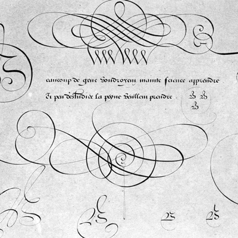
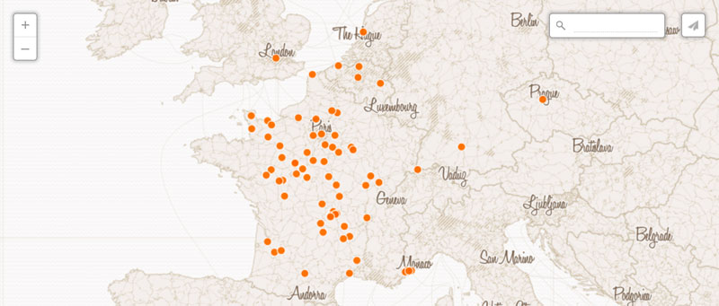

# Explore French Renaissance Paleography
Paleography is the history and study of handwriting. Old scripts can be very beautiful, but sometimes difficult to read. This site presents over 100 carefully selected French manuscripts written between 1300 and 1700, with tools for deciphering them and learning about their social, cultural, and institutional settings.

## [Get Started](get-started)

## Digital Collections

The Newberry Library has curated several collections for the study of scripts in context. Filter documents to discover an interesting topic, reading difficulty level, or time period.

[Manuscripts](https://centerfordigitalhumanities.github.io/Newberry-French-paleography/www/manuscripts.html)
[Calligraphy Books](https://centerfordigitalhumanities.github.io/Newberry-French-paleography/www/manuscripts.html)
[Historical Maps](https://centerfordigitalhumanities.github.io/Newberry-French-paleography/www/manuscripts.html)

## Region

